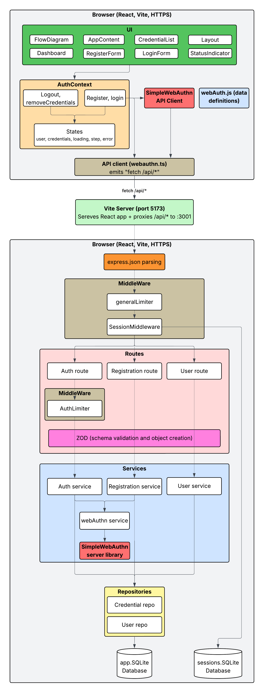

# Biometric Login Showcase

A demo web app showcasing [WebAuthn](https://webauthn.io/) biometric authentication (fingerprint, Face ID, Windows Hello) using:

- **[SimpleWebAuthn](https://simplewebauthn.dev/)** v13 (browser + server)
- **Express 4** + Node.js 20 backend
- **React 18** + Vite + Tailwind CSS frontend
- **SQLite** via `better-sqlite3` for persistence
- **npm workspaces** monorepo

## No Dev Container

### Quick Start (no Dev Container)

```bash
npm install
npm run dev
```

- Server: `http://localhost:3001`
- Client: `https://localhost:5173` (HTTPS required for WebAuthn)

### Run Tests (no Dev Container)

```bash
npm install
npm run dev
```

## Dev Container

### Quick Start (Dev Container)

1. Open the repo in VS Code and click **Reopen in Container** from pop-up message
2. Wait for `npm install` to finish.
3. In the container's terminal (inside VS code):

   ```bash
   npm run dev
   ```

4. VS Code will forward port `5173` and open `https://localhost:5173` in the browser. Accept the self-signed certificate once.

### Run Tests (Dev Container)

In the container's integrated terminal:

```bash
npm run test
```

## Usage

1. Open `https://localhost:5173`
2. Click **Register** and enter a username
3. Browser prompts for your biometric (fingerprint/Face ID/PIN)
4. After registration you're redirected to the Dashboard
5. Click **Sign Out**, then log back in with **Login with Biometric**

## Architecture


